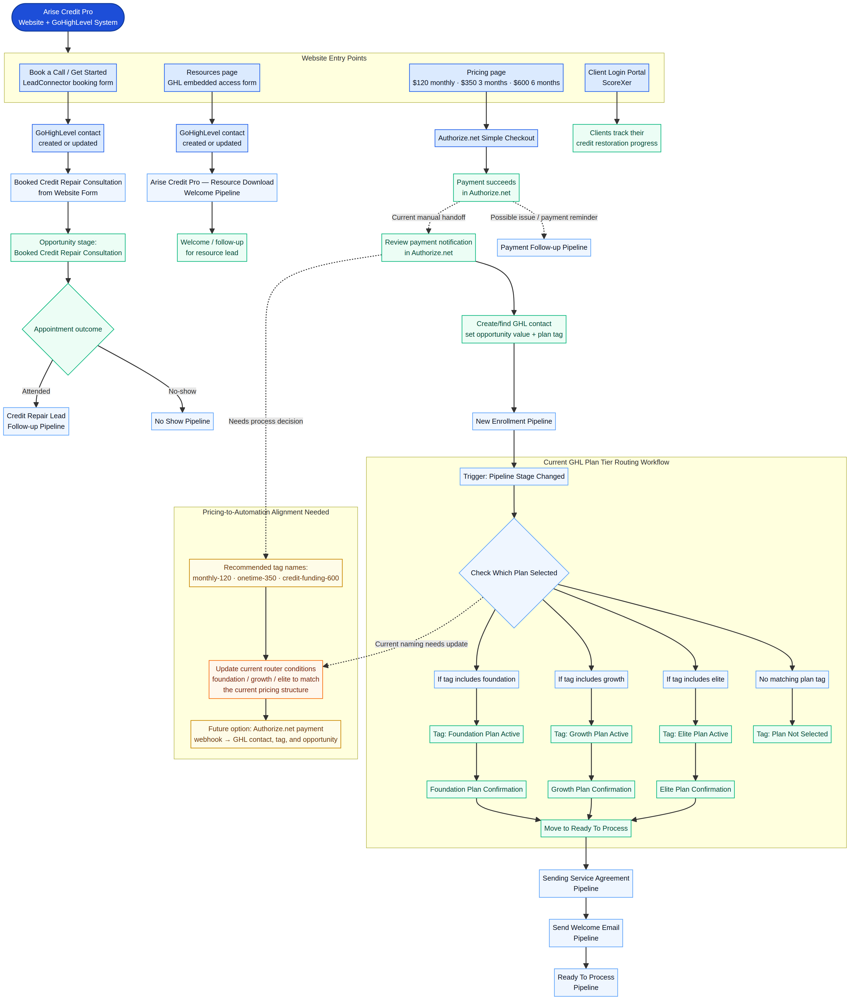

# Arise Credit Pro: GoHighLevel Automation Mind Map

> **This is the operational picture of what you have created.** It follows a person from your website entry point through GoHighLevel, then shows where your system is automated and where you currently take over manually.

## Your System at a Glance

Your website is already doing three important jobs: booking consultations, capturing resource-download leads, and sending interested buyers to secure payment checkout. GoHighLevel is the central CRM and operations hub where contacts, appointments, opportunities, plan routing, onboarding, and follow-up live. The ScoreXer portal gives active clients a separate place to view their credit-restoration progress.

| Website entry point | What the visitor does | What enters GoHighLevel | What happens next |
|---|---|---|---|
| **Book a Call / Get Started** | Completes the LeadConnector booking form and schedules time. | A contact is created or updated. | The **Booked Credit Repair Consultation from Website Form** workflow and booked-consultation opportunity stage handle the appointment path. |
| **Resources** | Completes the embedded GHL form to unlock a PDF. | A contact is created or updated. | The **Arise Credit Pro — Resource Download Welcome Pipeline** follows up with the resource lead. |
| **Pricing** | Selects the $120 monthly, $350 three-month, or $600 six-month option and pays through Authorize.net. | Payment first appears in Authorize.net. | You currently add or update the contact, opportunity, and plan tag in GHL manually. |
| **Client Login Portal** | Uses the ScoreXer link to sign in. | No new website lead workflow is created from this click. | Existing clients access their credit-restoration progress. |

## The Client Journey You Built

### 1. Consultation Lead Journey

The client starts on your website by clicking **Book a Call** or **Get Started**. The LeadConnector booking form captures their information and creates or updates their contact record in GoHighLevel. The **Booked Credit Repair Consultation from Website Form** workflow places them into the booked-consultation process.

From there, the appointment outcome determines the next route. An attended appointment can continue to your **Credit Repair Lead Follow-up Pipeline**. A missed appointment can be handled through the **No Show Pipeline**. This gives you a system for both your ready-to-talk leads and the people who need another opportunity to re-engage.

### 2. Free Resource Lead Journey

A visitor can open the Resources page, choose a guide, and submit the embedded GoHighLevel access form. That form creates or updates their GHL contact, and the **Arise Credit Pro — Resource Download Welcome Pipeline** takes over. This is your education-first lead source: someone can receive value before they are ready to book or buy.

### 3. Paid Client Journey

The Pricing page directs buyers to Authorize.net Simple Checkout. Once a payment is successful, the present handoff is manual: you review the payment, locate or create the person in GoHighLevel, assign the correct opportunity value, add the appropriate plan tag, and place the client into the **New Enrollment Pipeline**.

The **Plan Tier Routing** workflow then runs when the pipeline stage changes. In the version shown in your GoHighLevel screenshots, it evaluates the legacy tags **foundation**, **growth**, and **elite**. Each matching route applies an active-plan tag, sends a plan confirmation, and moves the client to **Ready To Process**. Your next onboarding steps are the **Sending Service Agreement Pipeline**, **Send Welcome Email Pipeline**, and **Ready To Process Pipeline**.

## What Is Automated Versus What Is Manual

| Area | Current state | Your role |
|---|---|---|
| Booking form and appointment entry | **Automated** | Monitor appointment outcomes and serve the lead. |
| Resource form and welcome flow | **Automated** | Review new resource leads and nurture them. |
| Payment checkout | **Automated in Authorize.net** | Confirm successful payment in Authorize.net. |
| Payment-to-GHL contact, opportunity, and tag | **Manual today** | Add/update the contact, set the opportunity value, tag the plan, and move them into enrollment. |
| Plan confirmation, agreement, welcome, and processing | **Automated after correct tag and enrollment stage** | Verify the right plan route fires. |
| Client progress access | **Automated via portal link** | Support clients who need login help. |

## The One Important Gap to Clean Up

Your public offers are now **$120 monthly**, **$350 for three months**, and **$600 for six months**. The routing workflow you showed still searches for **foundation**, **growth**, and **elite**. These names do not visibly match the current offers.

> If a paid client enters the New Enrollment Pipeline without a matching legacy tag, the workflow can send them down the “Plan Not Selected” path instead of their intended onboarding route.

The clearest plan is to choose one tag for each active offer, then update the Plan Tier Routing branches to check those tags. A simple naming structure could be `monthly-120`, `onetime-350`, and `credit-funding-600`. Once you decide on the final names, use the same tag names on the contact, the routing conditions, and any reporting smart lists.

## Your Repeatable Manual Enrollment Checklist

When a new payment appears in Authorize.net, use this exact sequence until you decide to automate the handoff.

| Step | Action in GoHighLevel | Result |
|---|---|---|
| **1** | Find the payer’s contact, or create one if it does not exist. | The buyer has a usable CRM record. |
| **2** | Add the plan tag that matches the purchase. | The routing workflow can identify the plan. |
| **3** | Create or update the opportunity and set its value to the paid amount. | Your pipeline reporting reflects the sale. |
| **4** | Move the client into the **New Enrollment Pipeline**. | Plan Tier Routing can start. |
| **5** | Confirm that the plan tag, confirmation email, agreement, welcome email, and Ready To Process movement occurred. | The client enters service with the correct path. |

## What You Have Built

You have not built “just a website.” You have created a connected customer journey: people can discover your business, book time with you, receive free education, pay for a plan, enter an enrollment process, receive onboarding communications, and log in to track progress. The mind map identifies the next major opportunity: making the payment-to-CRM handoff match the new pricing tags and eventually automating it.

## Source Note

This map is based on the workflows, pipelines, opportunity board, Plan Tier Routing diagram, Authorize.net checkout links, GoHighLevel forms, and ScoreXer portal configuration shared by Emperor during the Arise Credit Pro website build. Workflow names are preserved where they appeared in the shared GoHighLevel screenshots.
